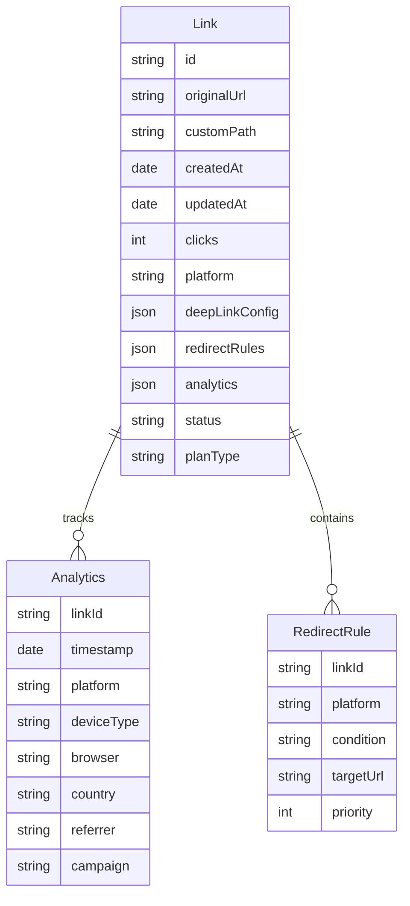
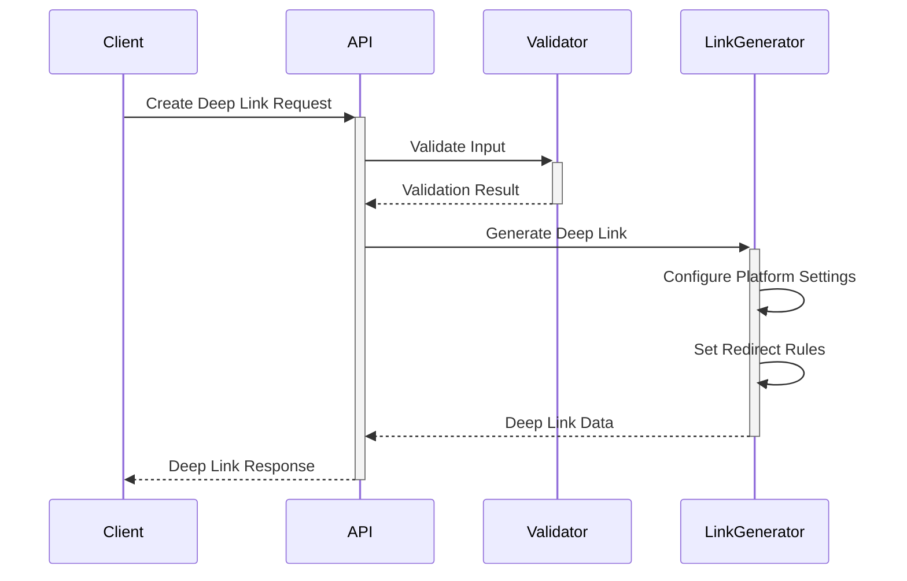
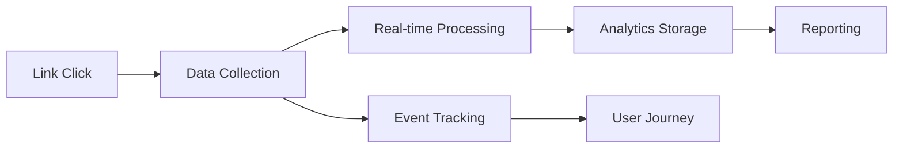
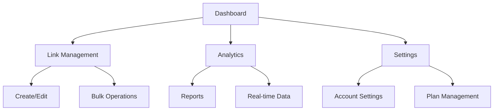

# Dynamic Link Service

次世代のディープリンク・スマートリダイレクトサービスの実装計画と仕様書です。

## 実装フェーズ

### Phase 1: データベーススキーマ拡張



#### スキーマ更新内容
- platform: iOS/Android/Web対応
- deepLinkConfig: アプリディープリンク設定
- redirectRules: リダイレクトルール
- analytics: 分析データ
- status: リンクステータス
- planType: プランタイプ

### Phase 2: コアシステム機能強化

#### ディープリンク生成機能



1. プラットフォーム別設定
   - iOS Universal Links
   - Android App Links
   - カスタムスキーム
   - ストアリンク

2. リダイレクト処理
   - デバイス判定
   - プラットフォーム判定
   - インストール状態確認
   - フォールバック処理

### Phase 3: 分析機能実装



#### トラッキング機能
- クリック数
- プラットフォーム統計
- コンバージョン追跡
- ユーザーフロー分析

#### レポーティング機能
- ダッシュボード
- カスタムレポート
- エクスポート機能

### Phase 4: 管理インターフェース



#### リンク管理機能
- 一覧表示
- 詳細編集
- バッチ操作
- 設定インポート/エクスポート

#### プラン管理
- 無料プラン制限
- スタータープラン機能
- ビジネスプラン機能

## 実装スケジュール

### First Priority (2-3週間)
- データベーススキーマ拡張
- 基本的なディープリンク生成
- プラットフォーム判定

### Second Priority (3-4週間)
- 高度なリダイレクト処理
- 分析基盤の実装
- 基本的な管理機能

### Third Priority (4-5週間)
- 詳細な分析機能
- プラン管理システム
- API実装

### Final Phase (2-3週間)
- パフォーマンス最適化
- セキュリティ強化
- ドキュメント作成

## 技術スタック

### フロントエンド（管理画面）
- Next.js
- TypeScript
- TailwindCSS
- React Query

### バックエンド
- Node.js/Express
- PostgreSQL（メインDB）
- Redis（キャッシュ/レートリミット用）
- OpenSearch（ログ分析用）

### インフラ
- AWS
  - Route 53（DNS）
  - CloudFront（CDN）
  - ECS Fargate（コンテナ実行環境）
  - RDS（PostgreSQL）
  - ElastiCache（Redis）
  - OpenSearch Service
- Datadog（監視）
- Sentry（エラー追跡）

### SDK提供
- iOS SDK (Swift)
  - ディープリンク処理
  - Universal Links処理
  - アプリ起動トラッキング
- Android SDK (Kotlin)
  - ディープリンク処理
  - App Links処理
  - アプリ起動トラッキング

## 技術的な考慮事項

### スケーラビリティ
- Firebase Firestoreの利用継続
- Redis導入によるキャッシュ層の追加
- クラウドファンクションの活用

### パフォーマンス
- リダイレクト応答時間: 50ms以内
- システム稼働率: 99.99%以上
- 同時アクセス処理: 10,000req/sec以上

### セキュリティ
- HTTPS対応必須
- アプリ認証機能
  - iOS Team ID検証
  - Android App Signing証明書検証
- 不正アクセス対策
  - レートリミット
  - DDoS対策
  - 不正パラメータ検証

## Getting Started

開発サーバーの起動:

```bash
npm run dev
# or
yarn dev
# or
pnpm dev
# or
bun dev
```

[http://localhost:3000](http://localhost:3000) をブラウザで開いてください。

## 環境構築

1. 必要な依存関係のインストール
```bash
npm install
```

2. 環境変数の設定
```bash
cp .env.example .env.local
```

3. 必要な環境変数を設定
- Firebase設定
- その他必要な API キー

4. データベースのセットアップ
```bash
npm run db:setup
```

## デプロイ

Vercel Platformを使用した簡単なデプロイ:
[Vercel Platform](https://vercel.com/new?utm_medium=default-template&filter=next.js&utm_source=create-next-app&utm_campaign=create-next-app-readme)

詳細は [Next.js deployment documentation](https://nextjs.org/docs/app/building-your-application/deploying) を参照してください。
